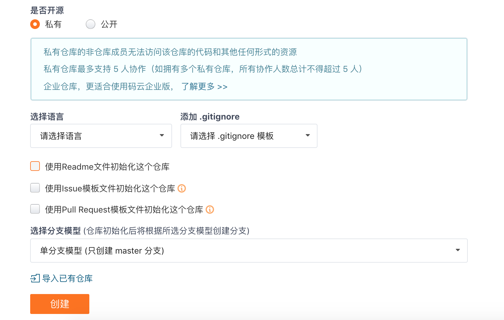
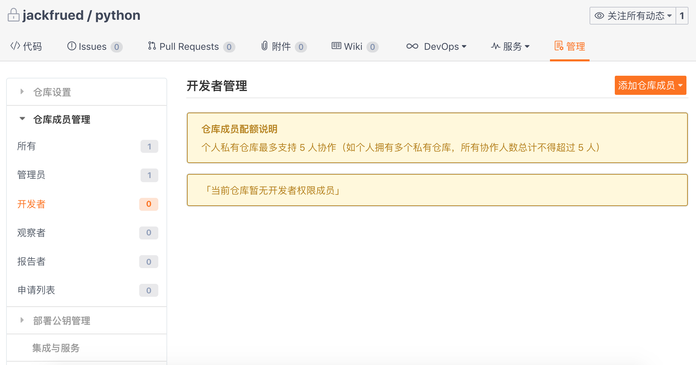
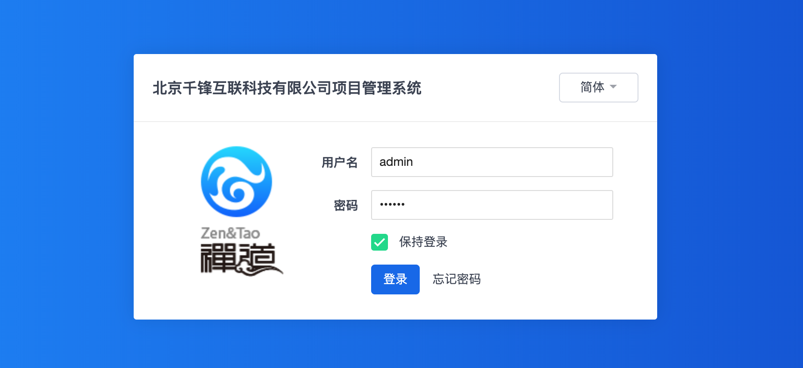
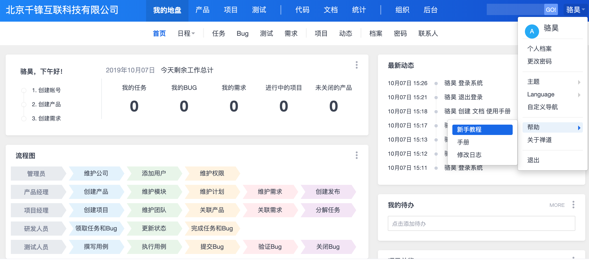

## 团队项目开发的问题和解决方案

我们经常听到个人开发和团队开发这两个词，所谓个人开发就是一个人把控产品的所有内容；而团队开发则是由多个人组成团队并完成产品的开发。要实施团队开发以下几点是必不可少的：

1. 对开发过程中的各种事件（例如：谁到什么时间完成了什么事情）进行管理和共享。
2. 在团队内部共享各类工作成果以及新的知识技巧等。
3. 管理工作成果的变更，既要防止成果被破坏，又要保证各个成员利用现有成果并行作业。
4. 证明团队开发出的软件在任何时候都是可以正常运行的。
5. 使用自动化的工作流程，让团队成员能够正确的实施开发、测试和部署。

### 团队项目开发常见问题

#### 问题1：传统的沟通方式无法确定处理的优先级

例如：使用邮件进行沟通可能出现邮件数量太多导致重要的邮件被埋没，无法管理状态，不知道哪些问题已经解决，哪些问题尚未处理，如果用全文检索邮件的方式来查询相关问题效率过于低下。

解决方案：使用缺陷管理工具。

#### 问题2：没有能够用于验证的环境

例如：收到项目正式环境中发生的故障报告后，需要还原正式环境需要花费很长的时间。

解决方法：实施持续交付。

#### 问题3：用别名目录管理项目分支

解决方法：实施版本控制。

#### 问题4：重新制作数据库非常困难

例如：正式环境和开发环境中数据库表结构不一致或者某个表列的顺序不一致。

解决方法：实施版本控制。

#### 问题5：不运行系统就无法察觉问题

例如：解决一个bug可能引入其他的bug或者造成系统退化，不正确的使用版本系统覆盖了其他人的修改，修改的内容相互发生了干扰，如果问题不能尽早发现，那么等过去几个月后再想追溯问题就非常麻烦了。

解决方法：实施持续集成，将团队成员的工作成果经常、持续的进行构建和测试。

#### 问题6：覆盖了其他成员修正的代码

解决方法：实施版本控制。

#### 问题7：无法实施代码重构

重构：在不影响代码产生的结果的前提下对代码内部的构造进行调整。

例如：在实施代码重构时可能引发退化。

解决方法：大量的可重用的测试并实施持续集成。

#### 问题8：不知道bug的修正日期无法追踪退化

解决方法：版本控制系统、缺陷管理系统和持续集成之间需要交互，最好能够和自动化部署工具集成到一起来使用。

#### 问题9：发布过程太复杂

解决方法：实施持续交付。

基于对上述问题的阐述和分析，我们基本上可以得到以下的结论，在团队开发中版本控制、缺陷管理和持续集成都是非常重要且不可或缺的。

### 版本控制

针对上面提到的一系列问题，我们可以得出一个简单的结论，版本控制是实施团队开发的首要前提，必须通过版本控制对产品研发过程中产生的各种信息进行管理，这些内容包括：

1. 代码。
2. 需求和设计的相关文档。
3. 数据库模式和初始数据。
4. 配置文件。
5. 库的依赖关系定义。

#### Git简介


Git是诞生于2005年的一个开源分布式版本控制系统，最初是Linus Torvalds（Linux之父） 为了帮助管理Linux内核开发而开发的一个版本控制软件。Git与常用的版本控制工具Subversion等不同，它采用了分布式版本控制的方式，在没有中央服务器支持的环境下也能够实施版本控制。

对于有使用Subversion（以下简称为SVN）经验的人来说，Git和SVN一样摒弃了基于锁定模式的版本控制方案（早期的CVS和VSS使用的就是锁定模式）采用了合并模式，而二者的区别在于：
    1. Git是分布式的，SVN是集中式的，SVN需要中央服务器才能工作。
    2. Git把内容按元数据方式存储，而SVN是按文件，即把文件的元信息隐藏在一个.svn文件夹里。
    3. Git分支和SVN的分支不同。
    4. Git没有一个全局版本号而SVN有。
    5. Git的内容完整性要优于SVN，Git的内容存储使用的是SHA-1哈希算法。这能确保代码内容的完整性，确保在遇到磁盘故障和网络问题时降低对版本库的破坏。  

#### 安装Git

可以在[Git官方网站](http://git-scm.com/)找到适合自己系统的Git下载链接并进行安装，macOS和Windows平台下安装Git都非常简单，Linux下如果要安装官方最新的版本，建议通过官方提供的Git源代码进行构建安装，步骤如下所示（以CentOS为例）。

下载Git源代码压缩文件。

```Shell
wget https://mirrors.edge.kernel.org/pub/software/scm/git/git-2.23.0.tar.xz
```

解压缩和解归档。

```Shell
xz -d git-2.23.0.tar.xz
tar -xvf git-2.23.0.tar
```

安装底层依赖库。

```Shell
yum -y install libcurl-devel
```

安装前的配置。

```Shell
cd git-2.23.0
./configure --prefix=/usr/local
```

构建和安装。

```Shell
make && make install
```

安装成功后可以在终端中键入下面的命令检查自己的Git版本。

```Shell
git --version
```

如果之前完全没有接触过Git，可以先阅读[《git - 简易指南》](http://www.bootcss.com/p/git-guide/)来对Git有一个大致的了解。

#### Git本地操作

可以使用下面的命令将一个文件夹变成Git仓库。
```Shell
git init 
```

当你完成了上述操作后，本地目录就变成了下面的样子，下图左边是你的工作区（正在操作的工作目录），而右边是你的本地仓库，中间是工作区和本地仓库之间的暂存区（也称为缓存区）。


> **提示**：用`ls -la`查看所有文件会发现在执行完上面的命令后，文件夹下多了一个名为`.git`的隐藏文件夹，这个文件夹就是Git版本仓库。

通过`git add`可以将指定的文件或所有文件添加到暂存区。

```Shell
git add <file>
git add .
```

这个时候使用下面的命令可以查看工作区、暂存区和本地仓库的状态。

```Shell
git status
```

如果不希望将文件添加到暂存区，可以按照提示，使用下面的命令将文件从暂存区放回到工作区。

```Shell
git rm --cached <file>
```

如果这个时候对工作区的文件又进行了修改使得工作区和暂存区的内容并不相同了，再次执行`git status`可以看到哪个或哪些文件被修改了，如果希望用暂存区的内容恢复工作区，可以使用下面的命令。

```Shell
git restore <file>
git restore .
```

> 提示：上面的命令目前仍然处于试验性阶段，在Git较早的版本中对应的命令是`git checkout -- <file>`。由于`git checkout`这个命令还可以用于切换分支，容易引起混淆，所以Git最新版本中将这个命令的两项功能分别赋予两个新的命令，一个就是上面的`git restore`，另一个是`git switch`。

如果第一次使用Git，需要配置用户名和邮箱，然后才能将代码提交到仓库。

```Shell
git config --global user.name "jackfrued"
git config --global user.email "jackfrued@126.com"
```

> **提示**：可以用`git config --list`来查看Git的配置信息。

通过下面的命令可以将暂存区的内容纳入本地仓库，

```Shell
git commit -m '本次提交的说明'
```

可以通过`git log`查看提交日志。

```Shell
git log
git log --graph --pretty=oneline --abbrev-commit
```

如果要回到历史版本，可以使用下面的命令。

```Shell
git reset --hard <commit-id>
git reset --hard HEAD^
```

#### Git服务器概述

Git不像SVN那样一定需要中央服务器才能工作，上面我们演示的版本控制操作都是在本地执行的，但是对于企业开发多人协作这样的环境就必须中央服务器的支持。通常，企业可以选择使用像Github这样的代码托管平台或自己搭建Git私服的方式来建立中央服务器。Github是一个基于Git的代码托管平台，企业用户（付费用户）可以创建私有仓库（仓库内容不对外公开），普通用户只能创建公开仓库（仓库内容对他人可见）。Github创办于2008年4月，目前是全世界最大的代码托管平台，它上面代码库惊人的增长速度也证明了它是非常成功的，在2018年6月被微软以75亿美元的天价收购，目前该平台已经向非企业用户开放了受限使用私有仓库的功能。

国内也有不少类似Github的代码托管平台，最有名的当属[码云](https://gitee.com/)和[CODING](https://coding.net/)，目前码云和CODING对注册用户都提供了受限的使用私有仓库的功能，支持**Pull Request**（本质是一种对话机制，可以在提交你的工作成果时让相关人员或团队注意到这件事情），同时还提供了对**缺陷管理**、**Web Hook**等功能支持，这些使得版本控制系统还具备了缺陷管理和持续集成的能力。当然，很多公司都不愿意将自己的商业代码托管于别人的平台，对于这样的公司可以使用[Gitlab](<https://about.gitlab.com/>)来搭建公司内部的Git私服，具体的做法在下一章为大家介绍。


这里我们直接以码云为例来说明Git服务器使用的一些注意事项。首先需要在码云上注册账号，当然也可以使用第三方登录（github账号、微信账号、新浪微博账号、CSDN账号等），登录成功后就可以创建项目，创建项目几乎是“傻瓜式”的，无需赘述，我们只对几个地方加以说明。

1. 创建项目时不建议勾选如下图所示的这些选项，编程语言可以暂时不做选择，而`.gitignore`模板也可以稍后自己编写或者通过更专业的工具（如：<http://gitignore.io/>网站）自动生成。

   

2. 添加项目成员。创建项目后，可以在项目的“设置”或“管理”中找到“成员管理”功能，这样就可以将其他开发者设置为项目团队的成员，项目成员通常分为“所有者”、“管理者”、“普通成员”和“受限成员”几种角色。

   

3. 项目的分支。创建项目后，项目只有一个默认的**master**分支，应该将该分支设置为“保护分支”来避免项目管理者之外的成员修改该分支。

4. 设置公钥实现免密访问。在项目的“设置”或“管理”中我们还可以找到“部署公钥管理”的选项，通过添加部署公钥，可以通过SSH（安全远程连接）的方式访问服务器而不用每次输入用户名和口令。可以使用`ssh-keygen`命令来创建密钥对。

   ```Shell
   ssh-keygen -t rsa -b 2048 -C "your_email@example.com"
   ```

   > **说明**：上面命令生成的密钥对在`~/.ssh`目录下，公钥文件默认的名字为`id_rsa.pub`，可以通过`cat id_rsa.pub`来查看自己的公钥。Windows用户在安装Git之后，可以通过**Git Bash**来输入上面的命令。

#### Git远程操作

在拥有了Git服务器之后，我们就可以通过Git的远程操作将自己的工作成果推到服务器上，也可以将他人的工作成果从服务器更新到本地，我们还是以刚才在码云上创建的名为`python`的仓库为例来说明如何进行远程操作。

1. 指定远程主机（Git服务器）。
2. 将本地代码（工作成果）推送到远程主机。
3. 从远程主机取回代码。

#### Git分支操作

1. 创建分支和切换分支。

   ```Shell
   git branch <branch-name>
   git switch <branch-name>
   ```

   或

   ```Shell
   git switch -c <branch-name>
   ```

   > **提示**：在之前的Git版本中，切换分支使用`git checkout <branch-name>`命令，也可以通过`git checkout -b <branch-name>`来创建并切换分支。`git switch`命令目前仍然处于试验性阶段，但很明显这个命令更加清晰的表达了它要做的事情。

2. 分支合并和变基。

3. 

#### Git工作流程（分支管理策略）

既然Git是团队开发必备的工具，那么在团队协作时就必须有一个规范的工作流程，这样才能让团队高效的工作，让项目顺利的进展下去，否则工具再厉害但团队成员各自为战，冲突就会无处不在，协作更加无从谈起。我们仍然以刚才码云上创建的`python`项目为例，来说明Git的分支管理策略。

##### Github-flow

1. 克隆服务器上的代码到本地。

   ```Shell
   git clone 
   ```

2. 创建并切换到自己的分支。

   ```Shell
   git switch -c 
   ```

3. 在自己的分支上开发并在本地做版本控制。

4. 将自己的分支（工作成果）推到服务器。

   ```Shell
   git push
   ```

5. 在线发起一次合并请求（通常称之为**Pull Request**，有的地方称为**Merge Request**），请求将自己的工作成果合并到master分支，合并之后可以删除该分支。

   

上面这种分支管理策略就是被称为github-flow或PR的流程，它非常简单容易理解，只需要注意以下几点：

1. master的内容都是可以进行发布的内容（不能直接在master上进行修改）。
2. 开发时应该以master为基础建立新分支（日常开发任务在自己的分支上进行）。
3. 分支先在本地实施版本控制，然后以同名分支定期向服务器进行push操作。
4. 开发任务完成后向master发送合并请求。
5. 合并请求通过审查之后合并到master，并从master向正式环境发布。

当然，github-flow的缺点也很明显，master分支默认就是当前的线上代码，但是有的时候工作成果合并到master分支，并不代表它就能立刻发布，这样就会导致线上版本落后于master分支。

##### Git-flow

除了上述的github-flow分支管理策略外，还有一种名为git-flow的分支管理策略，它也是大多数公司愿意使用的一套流程。Git-flow借鉴了中央集权型版本控制系统的长处，为团队内部统一建立、合并和关闭分支的方法，如下图所示。


在这种模式下，项目有两个长线分支，分别是master和develop，其他都是临时的的辅助分支，包括feature（开发特定功能的分支，开发结束后合并到develop）、release（从develop分离出来的为发布做准备的分支，发布结束后合并到master和develop）和hotfix（产品发布后出现问题时紧急建立的分支，直接从master分离，问题修复后合并到master并打上标签，同时还要合并到develop来避免将来的版本遗漏了这个修复工作，如果此时有正在发布中的release分支，还要合并到release分支）。这套分支管理策略比较容易控制各个分支的状况，但是在运用上github-flow要复杂得多，所以实际使用的时候可以安装名为`gitflow`的命令行工具或者使用图形化的Git工具（如：SmartGit、SourceTree等），这样可以大幅度的简化版本控制操作，具体的可以参考[《git-flow 的工作流程》](<https://www.git-tower.com/learn/git/ebook/cn/command-line/advanced-topics/git-flow>)一文。

### 缺陷管理

没有好的团队管理工具必然导致项目进展不顺利，任务管理困难，而引入缺陷管理系统正好可以解决这些问题，通常一个缺陷管理系统都包含了以下的功能：

1. 任务管理（包括必须做什么、谁来做、什么时候完成、现在处于什么状态等）。
2. 直观而且可以检索过去发生的各种问题。
3. 能够对信息进行统一的管理和共享。
4. 能够生成各类报表。
5. 能够关联到其他系统，具有可扩展性。

#### Redmine

Redmine是基于Ruby on Rails框架的开源缺陷管理系统，提供了问题管理、代码管理、Wiki等必要的功能，而且支持插件系统，扩展起来也非常容易。


如果希望了解和使用Redmine，可以关注[Redmine中文网](http://www.redmine.org.cn/)，上面提供了视频教程、经验分享以及其他安装和使用上的指导。

#### 禅道

[禅道](<https://www.zentao.net/>)是国产的专业项目管理软件，它不仅仅是缺陷管理工具，它提供了完整软件生命周期管理功能，支持Scrum敏捷开发，能够实现需求管理、缺陷管理、任务管理等一系列的功能，而且拥有强大的扩展机制和丰富的功能插件。可以从禅道的官方网站提供的[下载链接](<https://www.zentao.net/download.html>)来下载禅道，推荐使用一键安装包。

下面仍然以CentOS Linux为例，讲解如何利用官方提供的一键安装包来安装禅道。

```Shell
cd /opt
wget http://dl.cnezsoft.com/zentao/pro8.5.2/ZenTaoPMS.pro8.5.2.zbox_64.tar.gz
gunzip ZenTaoPMS.pro8.5.2.zbox_64.tar.gz
tar -xvf ZenTaoPMS.pro8.5.2.zbox_64.tar
```

我们在`/opt`目录下（官方推荐使用这个目录）下载了禅道的归档压缩文件，并进行了解压缩和解归档的操作，完成上述步骤后，会看到一个名为`zbox`的文件夹。一键安装包中内置了Apache、MySQL、PHP等应用，也就是说这些都不需要单独安装部署了，接下来我们通过下面的命令来启动禅道。

```Shell
/opt/zbox/zbox -ap 8080 -mp 3307
/opt/zbox/zbox start
```

> 说明：上面使用`zbox`文件夹下的`zbox`命令，其中`-ap`是为了指定Apache服务器使用的端口，`-mp`是为了指定MySQL数据库使用的端口；`start`表示启动服务，`stop`可以用来停止服务。此外，需要打开防火墙8080端口以便访问禅道（Apache服务器）。

打开浏览器，输入服务器的IP地址就可以访问禅道，如果愿意，也可以通过DNS解析绑定一个域名来进行访问，禅道的首页如下图所示，默认的管理员是`admin`，口令是`123456`。



第一次使用禅道时，建议通过点击用户名，然后通过“帮助”菜单的“新手教程”来迅速了解禅道。官方网站的文档链接中提供了[视频教程](<https://www.zentao.net/video/c1454.html>)，初学者也可以通过视频教程来上手。



#### Gitlab


### 持续集成

为了快速的产生高品质的软件，在团队开发中，持续集成（CI）也是一个非常重要的基础。按照经典的软件过程模型（瀑布模型），集成的工作一般要等到所有的开发工作都结束后才能开始，但这个时候如果发现了问题，修复问题的代价是非常具体的。基本上，集成实施得越晚，代码量越大，解决问题就越困难。持续集成将版本控制、自动化构建、代码测试融入到一起，让这些工作变得自动化和可协作。由于其频繁重复整个开发流程（在指定时间内多次pull源代码并运行测试代码），所以能帮助开发者提早发现问题。

在所有的CI工具中，Jenkins和[TravisCI](<https://www.travis-ci.org/>)是最具有代表性的，前者是基于 Java的开源CI工具，后者是新晋的在线CI工具。我们可以借助Docker来安装Jenkins（下一章节讲解），安装后……。Jenkins不仅能在面板上轻松看出任务成功或失败，还可以借助通知功能将结果以邮件或RSS订阅的形式发给用户。与此同时，Jenkins也允许通过插件进行功能扩展，所需功能可以随用随添加，而且还支持主从式集群，能够轻松的进行水平扩展。

